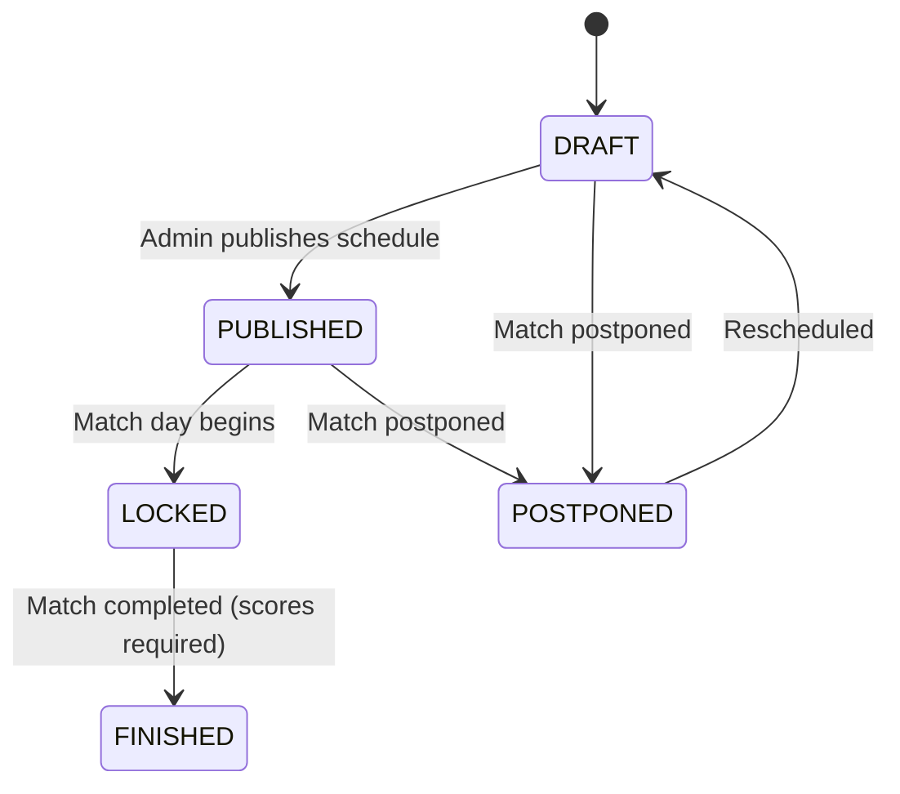
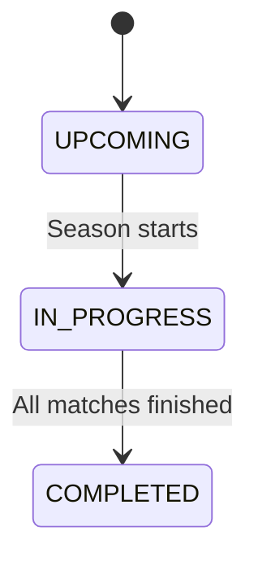
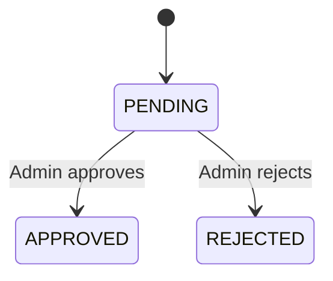

# Business Rules & Regulations Skill

This skill documents all VLeague-specific business rules, configurable regulations, state machines, and RBAC permissions.

## Configurable Regulations

Regulations are stored in the `regulations` table, scoped per season (`@@unique([seasonId, key])`). Each regulation has a `key`, `value`, and `valueType` (`INT` or `JSON`).

### Default Regulation Values

Defined in `DEFAULT_REGULATIONS` in `regulation.service.ts` and seeded per season:

| Key                   | Default | Type   | Description                  |
| --------------------- | ------- | ------ | ---------------------------- |
| `MIN_AGE`             | `16`    | number | Minimum player age           |
| `MAX_AGE`             | `40`    | number | Maximum player age           |
| `MIN_ROSTER`          | `15`    | number | Minimum players per team     |
| `MAX_ROSTER`          | `22`    | number | Maximum players per team     |
| `MAX_FOREIGN_PLAYERS` | `3`     | number | Max foreign players per team |
| `WIN_POINTS`          | `3`     | number | Points for a win             |
| `DRAW_POINTS`         | `1`     | number | Points for a draw            |
| `LOSS_POINTS`         | `0`     | number | Points for a loss            |
| `MAX_GOAL_TIME`       | `96`    | number | Maximum goal minute allowed  |

> [!TIP]
> To add a new regulation, add it to `DEFAULT_REGULATIONS` in `regulation.service.ts` and use `RegulationHelper.getNumericValue()` to query it.

### RegulationHelper Service

`RegulationHelper` (`regulation/regulation.helper.ts`) provides a clean interface for querying regulation values:

```typescript
// Query with season-specific override + fallback
const minAge = await this.regulationHelper.getNumericValue(
  seasonId, // optional — falls back to DEFAULT_REGULATIONS if null
  'MIN_AGE', // regulation key
  16, // fallback if neither DB nor defaults have the key
);
```

**Used by:**

- `RegistrationService` — age validation (`MIN_AGE`, `MAX_AGE`)
- `RosterService` — roster limits (`MAX_ROSTER`, `MAX_FOREIGN_PLAYERS`)
- `MatchService` — goal time validation (`MAX_GOAL_TIME`)

## Scoring & Ranking System

### Points

- **Win**: 3 points
- **Draw**: 1 point
- **Loss**: 0 points

### Ranking Tiebreak Order

1. Total points (descending)
2. Goal difference (descending)
3. Goals scored (descending)
4. Team name (alphabetically — fallback)

## State Machines

### Match Status Flow



**FINISHED transition guards:**

- `homeScore` and `awayScore` must both be set (not null)
- After FINISHED: standings are auto-recalculated for the season

> [!IMPORTANT]
> When a match transitions to FINISHED, `MatchService` automatically calls `StandingsService.getStandings(seasonId)` to recalculate the season standings.

### Season Status Flow



### Season Team Registration Status



## Player Constraints

| Constraint    | Rule                                                                            |
| ------------- | ------------------------------------------------------------------------------- |
| Age range     | Between `MIN_AGE` and `MAX_AGE` (queried from regulations via RegulationHelper) |
| Roster size   | Max `MAX_ROSTER` players (queried from regulations via RegulationHelper)        |
| Foreign limit | Max `MAX_FOREIGN_PLAYERS` foreign players (queried via RegulationHelper)        |
| Jersey number | Unique per team (via `team_players` table)                                      |
| Player type   | `DOMESTIC` or `FOREIGN`                                                         |
| Position      | `GK`, `DF`, `MF`, or `FW`                                                       |

## Match Events

| Event Type     | Description         | Goal Time Check  |
| -------------- | ------------------- | ---------------- |
| `GOAL`         | Regular goal        | ✅ MAX_GOAL_TIME |
| `OWN_GOAL`     | Own goal            | ✅ MAX_GOAL_TIME |
| `PENALTY`      | Penalty scored      | ✅ MAX_GOAL_TIME |
| `PENALTY_MISS` | Penalty missed      |                  |
| `YELLOW_CARD`  | Yellow card         |                  |
| `RED_CARD`     | Red card            |                  |
| `SUBSTITUTION` | Player substitution |                  |

Events are recorded with `minute`, `playerId`, `teamId`, and optional `note`.

> [!NOTE]
> Goal events (GOAL, OWN_GOAL, PENALTY) are validated against `MAX_GOAL_TIME` regulation. If `minute > MAX_GOAL_TIME`, the event is rejected.

## RBAC Permission Matrix

Based on actual `@Roles()` decorators in controllers:

| Action                        | ADMIN | TEAM_MANAGER | REFEREE | SUPERVISOR | PUBLIC |
| ----------------------------- | ----- | ------------ | ------- | ---------- | ------ |
| Manage users                  | ✅    |              |         |            |        |
| Create/Update/Delete teams    | ✅    |              |         |            |        |
| Create/Update/Delete stadiums | ✅    |              |         |            |        |
| Create/Update/Delete seasons  | ✅    |              |         |            |        |
| Manage regulations            | ✅    |              |         |            |        |
| Generate/Publish schedule     | ✅    |              |         |            |        |
| Register players              | ✅    | ✅           |         |            |        |
| Manage roster                 | ✅    | ✅           |         |            |        |
| Add match events              | ✅    |              | ✅      |            |        |
| View schedule                 | ✅    | ✅           | ✅      |            |        |
| View matches (all)            | ✅    | ✅           | ✅      |            |        |
| View standings (public)       | ✅    | ✅           | ✅      | ✅         | ✅     |

> [!NOTE]
> Endpoints **without** `@Roles()` but **with** `@UseGuards(JwtAuthGuard)` require any authenticated user.
> Endpoints **without** any guard are fully public (e.g., `GET /standings`, `GET /health`).

## User Roles

| Role           | Description               | Seed Account             |
| -------------- | ------------------------- | ------------------------ |
| `ADMIN`        | Full system administrator | `admin@demo.local`       |
| `TEAM_MANAGER` | Team manager              | `teammanager@demo.local` |
| `REFEREE`      | Match referee             | `referee@demo.local`     |
| `SUPERVISOR`   | League supervisor         | `supervisor@demo.local`  |
| `PUBLIC`       | Public viewer             | `public@demo.local`      |

- All demo accounts use password: `Demo@12345`
- Dual auth: `UserRole` enum on user + FK to `roles` table
