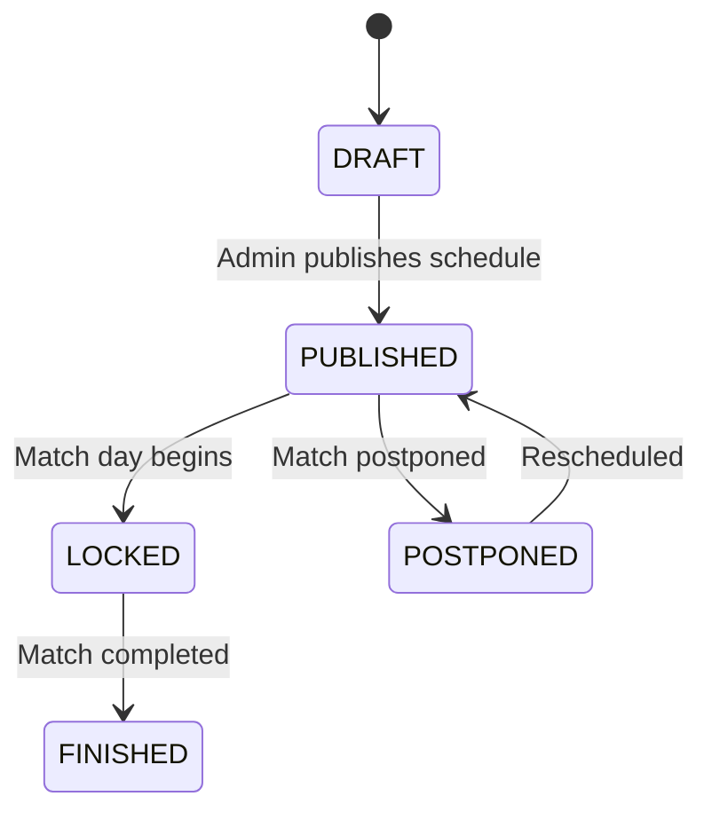
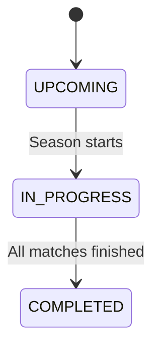
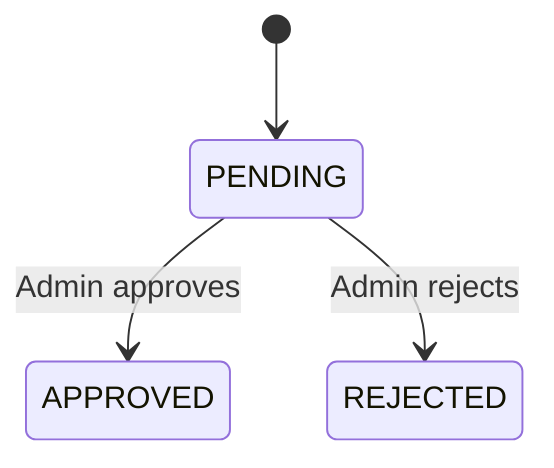

# Business Rules & Regulations Skill

This skill documents all VLeague-specific business rules, configurable regulations, state machines, and RBAC permissions.

## Configurable Regulations

Regulations are stored in the `regulations` table, scoped per season (`@@unique([seasonId, key])`). Each regulation has a `key`, `value`, and `valueType` (`INT` or `JSON`).

### Default Regulation Values (from seed)

| Key                      | Default Value                        | Type | Description                     |
| ------------------------ | ------------------------------------ | ---- | ------------------------------- |
| `player_age_min`         | `16`                                 | INT  | Minimum player age              |
| `player_age_max`         | `40`                                 | INT  | Maximum player age              |
| `team_player_min`        | `15`                                 | INT  | Minimum players per team        |
| `team_player_max`        | `22`                                 | INT  | Maximum players per team        |
| `foreign_max_registered` | `3`                                  | INT  | Max foreign players per team    |
| `goal_types`             | `["A","B","C"]`                      | JSON | Valid goal type categories      |
| `max_goal_minute`        | `90`                                 | INT  | Maximum goal minute             |
| `points_win`             | `3`                                  | INT  | Points for a win                |
| `points_draw`            | `1`                                  | INT  | Points for a draw               |
| `points_loss`            | `0`                                  | INT  | Points for a loss               |
| `rank_tiebreak_order`    | `["points","goal_diff","goals_for"]` | JSON | Tiebreak ranking criteria order |
| `total_legs`             | `2`                                  | INT  | Number of legs per season       |
| `rounds_per_season`      | `26`                                 | INT  | Rounds per season               |
| `matches_per_round`      | `7`                                  | INT  | Matches per round               |

> [!TIP]
> To add a new regulation, add it to `defaultRegulations` in `prisma/seed.ts` and to the relevant service logic.

## Scoring & Ranking System

### Points

- **Win**: 3 points
- **Draw**: 1 point
- **Loss**: 0 points

### Ranking Tiebreak Order

1. Total points (descending)
2. Goal difference (descending)
3. Goals scored (descending)
4. Team name (alphabetically — fallback)

## State Machines

### Match Status Flow

### Season Status Flow

### Season Team Registration Status

## Player Constraints

| Constraint    | Rule                                            |
| ------------- | ----------------------------------------------- |
| Age range     | Between `player_age_min` and `player_age_max`   |
| Roster size   | Between `team_player_min` and `team_player_max` |
| Foreign limit | Max `foreign_max_registered` foreign players    |
| Jersey number | Unique per team (via `team_players` table)      |
| Player type   | `DOMESTIC` or `FOREIGN`                         |
| Position      | `GK`, `DF`, `MF`, or `FW`                       |

## Match Events

| Event Type     | Description         |
| -------------- | ------------------- |
| `GOAL`         | Regular goal        |
| `OWN_GOAL`     | Own goal            |
| `YELLOW_CARD`  | Yellow card         |
| `RED_CARD`     | Red card            |
| `SUBSTITUTION` | Player substitution |

Events are recorded with `minute`, `playerId`, `teamId`, and optional `relatedPlayerId` (for substitutions or assists).

## RBAC Permission Matrix

Based on actual `@Roles()` decorators in controllers:

| Action                        | ADMIN | TEAM_MANAGER | REFEREE | SUPERVISOR | PUBLIC |
| ----------------------------- | ----- | ------------ | ------- | ---------- | ------ |
| Manage users                  | ✅    |              |         |            |        |
| Create/Update/Delete teams    | ✅    |              |         |            |        |
| Create/Update/Delete stadiums | ✅    |              |         |            |        |
| Create/Update/Delete seasons  | ✅    |              |         |            |        |
| Generate/Publish schedule     | ✅    |              |         |            |        |
| Register players              | ✅    | ✅           |         |            |        |
| Manage roster                 | ✅    | ✅           |         |            |        |
| Add match events              | ✅    |              | ✅      |            |        |
| View schedule                 | ✅    | ✅           | ✅      |            |        |
| View matches (all)            | ✅    | ✅           | ✅      |            |        |
| View standings (public)       | ✅    | ✅           | ✅      | ✅         | ✅     |

> [!NOTE]
> Endpoints **without** `@Roles()` but **with** `@UseGuards(JwtAuthGuard)` require any authenticated user.
> Endpoints **without** any guard are fully public (e.g., `GET /standings`, `GET /health`).

## User Roles

| Role           | Description               | Seed Account             |
| -------------- | ------------------------- | ------------------------ |
| `ADMIN`        | Full system administrator | `admin@demo.local`       |
| `TEAM_MANAGER` | Team manager              | `teammanager@demo.local` |
| `REFEREE`      | Match referee             | `referee@demo.local`     |
| `SUPERVISOR`   | League supervisor         | `supervisor@demo.local`  |
| `PUBLIC`       | Public viewer             | `public@demo.local`      |

- All demo accounts use password: `Demo@12345`
- Dual auth: `UserRole` enum on user + FK to `roles` table
