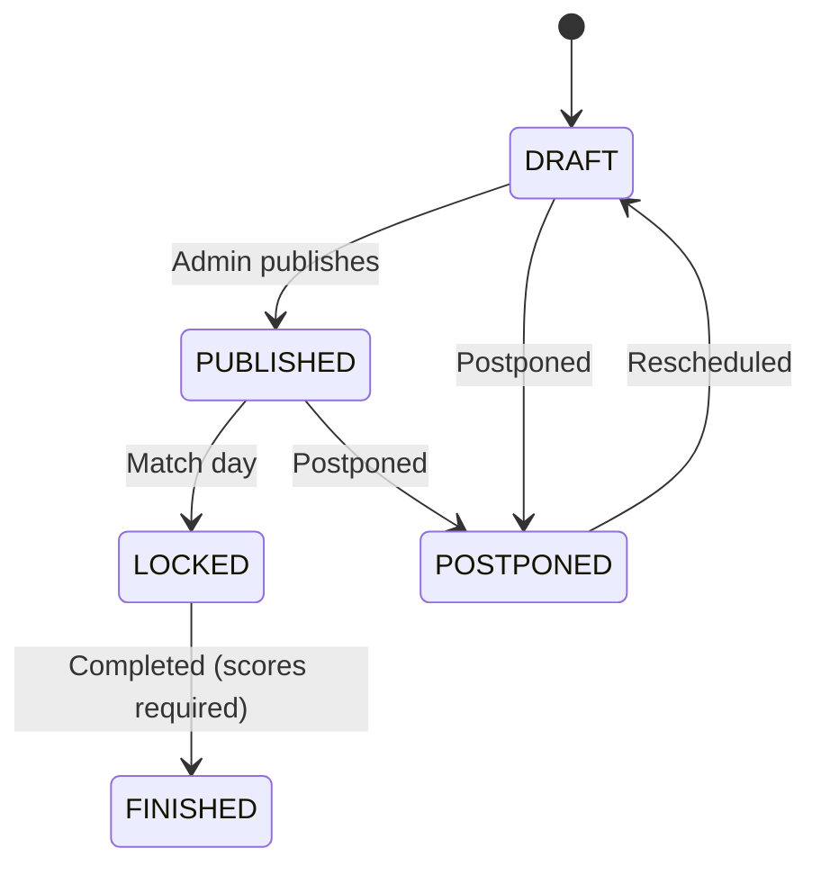

# Match Module

Module quản lý thông tin và sự kiện trận đấu trong hệ thống VLeague.

## Cấu trúc

```
match/
├── match.module.ts           # Module definition
├── match.controller.ts       # Match management endpoints
├── match.service.ts          # Match business logic
├── match.service.spec.ts     # Unit tests
└── dto/
    └── add-match-event.dto.ts
```

## Module Dependencies

```typescript
@Module({
  imports: [PrismaModule, StandingsModule, RegulationModule],
  controllers: [MatchController],
  providers: [MatchService],
  exports: [MatchService],
})
```

- **StandingsModule** — auto-recalculate standings when match finishes
- **RegulationModule** — validate `MAX_GOAL_TIME` for goal events

## API Endpoints

| Method  | Endpoint                  | Role           | Mô tả                        |
| ------- | ------------------------- | -------------- | ---------------------------- |
| `GET`   | `/api/matches`            | Public         | Lấy danh sách matches        |
| `GET`   | `/api/matches/:id`        | Public         | Lấy thông tin chi tiết match |
| `POST`  | `/api/matches/:id/events` | ADMIN, REFEREE | Thêm sự kiện trong match     |
| `PATCH` | `/api/matches/:id`        | ADMIN          | Cập nhật match info          |
| `PATCH` | `/api/matches/:id/status` | ADMIN          | Chuyển trạng thái match      |

## Match Status Flow



**FINISHED transition guards:**

- `homeScore` and `awayScore` must both be set (not null)
- After FINISHED → standings are auto-recalculated for the season

## Match Events

| Event Type     | Description         | Goal Time Check  |
| -------------- | ------------------- | ---------------- |
| `GOAL`         | Regular goal        | ✅ MAX_GOAL_TIME |
| `OWN_GOAL`     | Own goal            | ✅ MAX_GOAL_TIME |
| `PENALTY`      | Penalty scored      | ✅ MAX_GOAL_TIME |
| `PENALTY_MISS` | Penalty missed      |                  |
| `YELLOW_CARD`  | Yellow card         |                  |
| `RED_CARD`     | Red card            |                  |
| `SUBSTITUTION` | Player substitution |                  |

> Goal events (GOAL, OWN_GOAL, PENALTY) are validated against `MAX_GOAL_TIME` regulation (default 96). If `minute > MAX_GOAL_TIME`, the event is rejected.

## Business Rules

1. **Score Calculation:** Auto-update `homeScore`/`awayScore` when GOAL/OWN_GOAL events are added/deleted
2. **Status Guards:** Cannot transition to FINISHED without scores set
3. **Standings Trigger:** Upon FINISHED, `StandingsService.getStandings(seasonId)` is called automatically
4. **MAX_GOAL_TIME:** Goal events with `minute > MAX_GOAL_TIME` are rejected (regulation-based)

## Testing

```bash
npx jest match.service.spec --verbose
```

Test coverage includes:

- Match retrieval and filtering
- Event creation/deletion with score recalculation
- Status transitions (valid and invalid)
- FINISHED requires scores (BadRequestException)
- FINISHED triggers standings recalculation
- MAX_GOAL_TIME enforcement for goal events

## Swagger

Tham khảo Swagger docs tại: `http://localhost:8080/docs#/Match`
