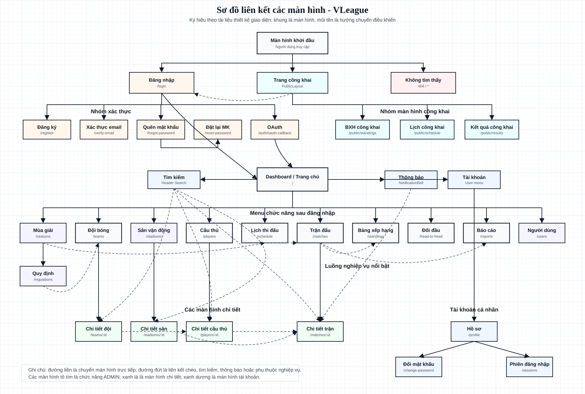

# Sơ đồ liên kết giao diện VLeague

Sơ đồ này được vẽ lại theo hướng dẫn trong file `CHUONG 7 - THIET KE GIAO DIEN.pdf`,
đặc biệt phần **II.1 Sơ đồ liên kết các màn hình**:

- Mỗi khung chữ nhật biểu diễn một màn hình.
- Mũi tên biểu diễn hướng chuyển điều khiển giữa các màn hình.
- Đường liền là chuyển màn hình trực tiếp.
- Đường đứt là liên kết chéo, tìm kiếm, thông báo hoặc phụ thuộc nghiệp vụ.

## Sơ đồ

## Nguồn xây dựng

Sơ đồ được tổng hợp từ các file frontend chính:

- `apps/web/src/App.tsx`
- `apps/web/src/shell/menu.ts`
- `apps/web/src/shell/AppShell.tsx`
- `apps/web/src/shell/PublicLayout.tsx`
- Các liên kết `navigate` / `Link` trong `apps/web/src/pages`

## Nhóm màn hình

| Nhóm            | Màn hình                                                                                                                 |
| --------------- | ------------------------------------------------------------------------------------------------------------------------ |
| Khởi đầu        | Màn hình khởi đầu, Đăng nhập, Trang công khai, Không tìm thấy                                                            |
| Xác thực        | Đăng ký, Xác thực email, Quên mật khẩu, Đặt lại mật khẩu, OAuth                                                          |
| Công khai       | BXH công khai, Lịch công khai, Kết quả công khai                                                                         |
| Sau đăng nhập   | Dashboard, Tìm kiếm, Thông báo, Tài khoản                                                                                |
| Chức năng chính | Mùa giải, Đội bóng, Sân vận động, Cầu thủ, Lịch thi đấu, Trận đấu, Bảng xếp hạng, Đối đầu, Báo cáo, Người dùng, Quy định |
| Chi tiết        | Chi tiết đội, Chi tiết sân, Chi tiết cầu thủ, Chi tiết trận                                                              |
| Tài khoản       | Hồ sơ, Đổi mật khẩu, Phiên đăng nhập                                                                                     |
