# VLeague Management System — Use Case Diagram (v2)

> Cập nhật theo phản hồi review UML. Xem phiên bản cũ: `usecase_diagram.png`

---

## Sơ đồ Use Case (Mermaid)

```mermaid
flowchart LR
  classDef actor fill:#ffffff,stroke:#333333,color:#111827,stroke-width:1.5px;
  classDef actorBase fill:#f3f4f6,stroke:#333333,color:#111827,stroke-width:1.5px;
  classDef usecase fill:#e8f4fd,stroke:#2196f3,color:#0f172a,stroke-width:1.5px;

  User[User<br/>base]
  Admin[Admin]
  TM[Team Manager]
  Referee[Referee]
  Supervisor[Supervisor]
  Public[Public]

  class User actorBase;
  class Admin,TM,Referee,Supervisor,Public actor;

  Admin -. inherits .-> User
  TM -. inherits .-> User
  Referee -. inherits .-> User
  Supervisor -. inherits .-> User
  Public -. inherits .-> User

  subgraph System[VLeague Management System]
    direction LR

    subgraph Auth[Authentication]
      direction TB
      UC_Login([Đăng nhập])
      UC_Register([Đăng ký])
      UC_Logout([Đăng xuất])
      UC_ChangePW([Đổi mật khẩu])
      UC_ForgotPW([Quên mật khẩu])
      UC_OAuth([OAuth<br/>Google/Facebook])
    end

    subgraph UserManagement[User Management]
      direction TB
      UC_ViewUsers([Xem danh sách<br/>người dùng])
      UC_AddUser([Thêm người dùng])
      UC_AssignRole([Phân quyền<br/>người dùng])
      UC_DeleteUser([Xóa người dùng])
    end

    subgraph TeamPlayer[Team and Player]
      direction TB
      UC_ViewTeams([Xem danh sách<br/>đội bóng])
      UC_AddTeam([Thêm đội bóng])
      UC_EditTeam([Sửa đội bóng])
      UC_DeleteTeam([Xóa đội bóng])
      UC_ViewPlayers([Xem danh sách<br/>cầu thủ])
      UC_AddPlayer([Thêm cầu thủ])
      UC_EditPlayer([Sửa cầu thủ])
      UC_DeletePlayer([Xóa cầu thủ])
      UC_Roster([Quản lý đội hình<br/>Roster])
    end

    subgraph SeasonRegulation[Season and Regulation]
      direction TB
      UC_ViewSeason([Xem mùa giải])
      UC_ManageSeason([Thêm hoặc sửa mùa giải])
      UC_DeleteSeason([Xóa mùa giải])
      UC_ViewRegulation([Xem quy định])
      UC_EditRegulation([Cập nhật quy định])
      UC_ApproveTeam([Duyệt đăng ký<br/>đội tham gia])
    end

    subgraph Stadium[Stadium]
      direction TB
      UC_ViewStadium([Xem sân vận động])
      UC_ManageStadium([Thêm hoặc sửa<br/>sân vận động])
      UC_DeleteStadium([Xóa sân vận động])
    end

    subgraph ScheduleMatch[Schedule and Match]
      direction TB
      UC_ViewSchedule([Xem lịch thi đấu])
      UC_CreateSchedule([Lập lịch thi đấu])
      UC_ViewResult([Xem kết quả<br/>trận đấu])
      UC_RecordResult([Ghi nhận kết quả<br/>trận đấu])
      UC_MatchEvent([Quản lý sự kiện<br/>trận đấu])
    end

    subgraph StandingsReports[Standings and Reports]
      direction TB
      UC_Standings([Xem bảng xếp hạng])
      UC_Stats([Xem thống kê<br/>và báo cáo])
      UC_Search([Tìm kiếm])
      UC_SupervisorReport([Gửi báo cáo<br/>giám sát trận])
    end
  end

  class UC_Login,UC_Register,UC_Logout,UC_ChangePW,UC_ForgotPW,UC_OAuth,UC_ViewUsers,UC_AddUser,UC_AssignRole,UC_DeleteUser,UC_ViewTeams,UC_AddTeam,UC_EditTeam,UC_DeleteTeam,UC_ViewPlayers,UC_AddPlayer,UC_EditPlayer,UC_DeletePlayer,UC_Roster,UC_ViewSeason,UC_ManageSeason,UC_DeleteSeason,UC_ViewRegulation,UC_EditRegulation,UC_ApproveTeam,UC_ViewStadium,UC_ManageStadium,UC_DeleteStadium,UC_ViewSchedule,UC_CreateSchedule,UC_ViewResult,UC_RecordResult,UC_MatchEvent,UC_Standings,UC_Stats,UC_Search,UC_SupervisorReport usecase;

  User --> UC_Login
  User --> UC_Register
  User --> UC_Logout
  User --> UC_ChangePW
  User --> UC_ForgotPW

  Admin --> UC_ViewUsers
  Admin --> UC_AddUser
  Admin --> UC_AssignRole
  Admin --> UC_DeleteUser
  Admin --> UC_AddTeam
  Admin --> UC_EditTeam
  Admin --> UC_DeleteTeam
  Admin --> UC_ManageSeason
  Admin --> UC_DeleteSeason
  Admin --> UC_EditRegulation
  Admin --> UC_ApproveTeam
  Admin --> UC_ManageStadium
  Admin --> UC_DeleteStadium
  Admin --> UC_CreateSchedule
  Admin --> UC_RecordResult

  TM --> UC_AddPlayer
  TM --> UC_EditPlayer
  TM --> UC_DeletePlayer
  TM --> UC_Roster

  Referee --> UC_MatchEvent
  Referee --> UC_RecordResult

  Supervisor --> UC_SupervisorReport

  Public --> UC_ViewTeams
  Public --> UC_ViewPlayers
  Public --> UC_ViewSeason
  Public --> UC_ViewRegulation
  Public --> UC_ViewStadium
  Public --> UC_ViewSchedule
  Public --> UC_ViewResult
  Public --> UC_Standings
  Public --> UC_Stats
  Public --> UC_Search

  UC_OAuth -. <<extend>> .-> UC_Login
  UC_RecordResult -. <<include>> .-> UC_MatchEvent
  UC_CreateSchedule -. <<include>> .-> UC_ViewSeason
```

GitHub render được Mermaid trực tiếp trong Markdown. Mermaid chưa có cú pháp UML use case thuần như PlantUML, nên sơ đồ bên dưới được biểu diễn theo dạng flowchart nhưng vẫn giữ nguyên actor, system boundary và quan hệ `<<include>>` / `<<extend>>`.

---

## Tóm tắt thay đổi so với v1

| #   | Vấn đề (v1)                                              | Cách sửa (v2)                                                                       |
| --- | -------------------------------------------------------- | ----------------------------------------------------------------------------------- |
| 1   | Public thiếu "Xem lịch thi đấu" & "Xem kết quả trận đấu" | Thêm `UC_ViewSchedule`, `UC_ViewResult` cho Public                                  |
| 2   | "Quản lý phiên đăng nhập" không phải mục tiêu nghiệp vụ  | Thay bằng `Đăng xuất`, `Đổi mật khẩu`, `Quên mật khẩu`                              |
| 3   | OAuth ngang hàng với Đăng nhập                           | Chuyển OAuth thành `<<extend>>` của Đăng nhập                                       |
| 4   | Supervisor gắn "Quản lý sân vận động" — sai vai trò      | Supervisor chỉ có "Gửi báo cáo giám sát trận"; Xem lịch/trận kế thừa từ User/Public |
| 5   | Use case quá lớn ("Quản lý đội bóng")                    | Tách CRUD: Xem / Thêm / Sửa / Xóa riêng                                             |
| 6   | Nhãn "Admin" trùng actor                                 | Đổi thành "User Management"                                                         |
| 7   | Không có actor generalization                            | Thêm actor cha `User` → kế thừa 5 actor con                                         |
| 8   | Thiếu `<<include>>` / `<<extend>>`                       | Thêm `<<extend>>` (OAuth), `<<include>>` (RecordResult → MatchEvent)                |

---

## Actor – Use Case Matrix

| Use Case                        | Public  | Team Manager | Referee | Supervisor | Admin |
| ------------------------------- | :-----: | :----------: | :-----: | :--------: | :---: |
| Đăng nhập / Đăng ký / Đăng xuất |    —    |      ✓       |    ✓    |     ✓      |   ✓   |
| Đổi / Quên mật khẩu             |    —    |      ✓       |    ✓    |     ✓      |   ✓   |
| OAuth (extend Đăng nhập)        |    —    |      ✓       |    ✓    |     ✓      |   ✓   |
| Xem đội bóng / cầu thủ          |    ✓    |      ✓       |    ✓    |     ✓      |   ✓   |
| Thêm / Sửa / Xóa đội bóng       |    —    |      —       |    —    |     —      |   ✓   |
| Thêm / Sửa / Xóa cầu thủ        |    —    |      ✓       |    —    |     —      |   ✓   |
| Quản lý đội hình (Roster)       |    —    |      ✓       |    —    |     —      |   ✓   |
| Xem mùa giải / quy định         |    ✓    |      ✓       |    ✓    |     ✓      |   ✓   |
| Thêm / Sửa / Xóa mùa giải       |    —    |      —       |    —    |     —      |   ✓   |
| Cập nhật quy định               |    —    |      —       |    —    |     —      |   ✓   |
| Duyệt đăng ký đội               |    —    |      —       |    —    |     —      |   ✓   |
| Xem / Thêm / Sửa / Xóa sân      | ✓ (xem) |      —       |    —    |     —      |   ✓   |
| Xem lịch thi đấu                |    ✓    |      ✓       |    ✓    |     ✓      |   ✓   |
| Lập lịch thi đấu                |    —    |      —       |    —    |     —      |   ✓   |
| Xem kết quả trận đấu            |    ✓    |      ✓       |    ✓    |     ✓      |   ✓   |
| Ghi nhận kết quả trận đấu       |    —    |      —       |    ✓    |     —      |   ✓   |
| Quản lý sự kiện trận đấu        |    —    |      —       |    ✓    |     —      |   ✓   |
| Xem BXH / Thống kê / Tìm kiếm   |    ✓    |      ✓       |    ✓    |     ✓      |   ✓   |
| Gửi báo cáo giám sát trận       |    —    |      —       |    —    |     ✓      |   —   |
| Quản lý người dùng (CRUD)       |    —    |      —       |    —    |     —      |   ✓   |
